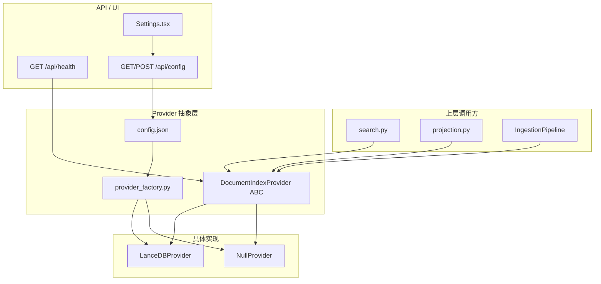

# 设计文档：Provider 层清理与重构

## Overview

本设计将 DocumentIndexProvider 层从 4 个实现（Cognee/LanceDB/HRR/Null）精简为 2 个（LanceDB + Null），修复 LanceDB 已知问题，增强 ABC 接口（健康检查、生命周期钩子、异步初始化），并通过 Config API + Settings UI 让用户可配置 Provider 选择。

核心设计原则：
- **最小破坏**：上层（search.py、projection.py）通过 ABC 解耦，只需清理引用即可
- **渐进增强**：ABC 新增方法提供默认空实现，不破坏现有 Provider
- **配置驱动**：工厂从 config.json 读取用户选择，取代硬编码优先级

## Architecture



### 变更范围

| 模块 | 变更类型 | 说明 |
|------|---------|------|
| `providers/cognee.py` | 删除 | 移除文件 |
| `providers/hrr.py` | 删除 | 移除文件 |
| `memory/cognify_loop.py` | 删除 | 移除文件 |
| `memory/datasets.py` | 删除 | 移除文件 |
| `document_index_provider.py` | 修改 | 新增 health_check、on_session_end、shutdown；initialize 改 async |
| `provider_factory.py` | 重写 | 从 config.json 读取配置，只注册 LanceDB + Null |
| `providers/lancedb.py` | 修改 | 修复 SQL 注入、异步初始化、实现健康检查和生命周期钩子 |
| `providers/null.py` | 修改 | 实现新增的 ABC 方法 |
| `projection.py` | 修改 | 清理 Cognee 引用，重命名 projected_cognee_at |
| `search.py` | 修改 | 清理注释中的 Cognee/HRR 引用 |
| `startup.py` | 修改 | 清理 Cognee 引用，shutdown 调用 provider.shutdown() |
| `health/router.py` | 修改 | 返回 provider 健康状态 |
| `config/router.py` | 修改 | 支持 document_index_provider 字段 |
| `core/config.py` | 修改 | load/save/apply 支持新字段 |
| `Settings.tsx` | 修改 | 新增语义搜索 Provider 选择 UI |

## Components and Interfaces

### DocumentIndexProvider ABC（增强后）

```python
from enum import Enum

class HealthStatus(str, Enum):
    READY = "ready"
    DEGRADED = "degraded"
    ERROR = "error"
    NOT_INITIALIZED = "not_initialized"

class DocumentIndexProvider(ABC):
    # 现有方法（保持不变）
    @classmethod
    @abstractmethod
    def provider_name(cls) -> str: ...

    @property
    def name(self) -> str: ...

    @classmethod
    @abstractmethod
    def is_available(cls) -> bool: ...

    @abstractmethod
    async def prefetch(self, query: str) -> list[ProviderHit]: ...

    @abstractmethod
    async def sync_document(self, content: str, doc_id: str, metadata: dict | None = None) -> None: ...

    async def clear(self) -> bool: ...
    async def delete_document(self, doc_id: str) -> bool: ...
    def get_tool_schemas(self) -> list[dict]: ...
    async def handle_tool_call(self, name: str, args: dict) -> str: ...

    # 新增方法
    @abstractmethod
    async def initialize(self) -> None:
        """异步初始化（替代原同步 initialize）。"""

    def health_check(self) -> HealthStatus:
        """返回当前健康状态。默认 READY。"""
        return HealthStatus.READY

    async def on_session_end(self) -> None:
        """对话结束时调用。默认空操作。"""

    async def shutdown(self) -> None:
        """应用关闭时调用。默认空操作。"""
```

### provider_factory.py（重写后）

```python
from backend.core.config import load_user_config

_PROVIDER_REGISTRY: dict[str, type[DocumentIndexProvider]] = {}

def _register_providers() -> None:
    from backend.modules.data_sources.ingestion.providers.lancedb import LanceDBProvider
    from backend.modules.data_sources.ingestion.providers.null import NullProvider
    _PROVIDER_REGISTRY["lancedb"] = LanceDBProvider
    _PROVIDER_REGISTRY["null"] = NullProvider

async def create_document_index_provider() -> DocumentIndexProvider:
    """根据 config.json 创建 Provider 实例。"""
    if not _PROVIDER_REGISTRY:
        _register_providers()

    user_config = load_user_config()
    backend = user_config.get("document_index_provider", "lancedb")

    if backend == "disabled":
        backend = "null"

    provider_cls = _PROVIDER_REGISTRY.get(backend)
    if not provider_cls:
        logger.warning(f"Unknown provider '{backend}', falling back to null")
        provider_cls = NullProvider

    # LanceDB 依赖不可用时降级
    if backend == "lancedb" and not provider_cls.is_available():
        logger.warning("LanceDB dependencies not available, falling back to null")
        provider_cls = NullProvider

    provider = provider_cls()
    await provider.initialize()
    return provider
```

### LanceDBProvider 修复

#### SQL 注入修复（delete_document）

```python
async def delete_document(self, doc_id: str) -> bool:
    if self._table is None:
        return False
    try:
        # 转义单引号：' → ''
        safe_id = doc_id.replace("'", "''")
        self._table.delete(f"doc_id = '{safe_id}'")
        return True
    except Exception as exc:
        logger.error("lancedb.delete_failed", doc_id=doc_id, error=str(exc))
        return False
```

#### 异步初始化

```python
async def initialize(self) -> None:
    """异步初始化：模型加载和 DB 连接在线程池中执行。"""
    try:
        await asyncio.to_thread(self._blocking_initialize)
        self._health = HealthStatus.READY
    except Exception as exc:
        self._health = HealthStatus.ERROR
        self._error_msg = str(exc)
        logger.error("lancedb.init_failed", error=str(exc))

def _blocking_initialize(self) -> None:
    """阻塞初始化逻辑（在线程池中执行）。"""
    import lancedb
    from sentence_transformers import SentenceTransformer

    self._db_path.mkdir(parents=True, exist_ok=True)
    self._db = lancedb.connect(str(self._db_path))
    logger.info("lancedb.loading_embedding_model", model="all-MiniLM-L6-v2")
    self._embedder = SentenceTransformer("all-MiniLM-L6-v2")
    # 创建或打开表...
```

#### 健康检查和生命周期

```python
def health_check(self) -> HealthStatus:
    return self._health

async def on_session_end(self) -> None:
    """LanceDB 无需 session 级别操作。"""
    pass

async def shutdown(self) -> None:
    """释放资源。"""
    self._embedder = None
    self._table = None
    self._db = None
    self._health = HealthStatus.NOT_INITIALIZED
    logger.info("lancedb.shutdown")
```

### Config 层变更

`config.json` 新增字段：

```json
{
  "llm_provider": "dashscope",
  "llm_model": "qwen-plus",
  "document_index_provider": "lancedb"
}
```

允许值：`"lancedb"` | `"disabled"`

`apply_user_config` 中新增对 `document_index_provider` 的处理（仅持久化，不动态切换 — 需重启生效）。

### Health API 响应格式

```json
{
  "status": "ok",
  "version": "0.3.0",
  "document_index_provider": {
    "name": "lancedb",
    "status": "ready",
    "type": "vector"
  }
}
```

### Settings UI 新增

在"记忆"Tab 中新增"语义搜索"区块：

```
┌─────────────────────────────────────────┐
│ 语义搜索                                 │
│ ┌─────────────────────────────────────┐ │
│ │ Provider: [LanceDB（向量搜索） ▼]    │ │
│ │ 状态: ● 就绪                        │ │
│ └─────────────────────────────────────┘ │
│ 切换后需重启应用生效                      │
└─────────────────────────────────────────┘
```

选项：
- "LanceDB（向量搜索）" → 保存 `"lancedb"`
- "关闭（仅关键词搜索）" → 保存 `"disabled"`

## Data Models

### HealthStatus 枚举

```python
class HealthStatus(str, Enum):
    READY = "ready"
    DEGRADED = "degraded"
    ERROR = "error"
    NOT_INITIALIZED = "not_initialized"
```

### Config API 扩展

ConfigResponse 新增字段：
```python
class ConfigResponse(BaseModel):
    # ... 现有字段 ...
    document_index_provider: str = "lancedb"
    document_index_provider_status: str = "ready"
```

ConfigUpdate 新增字段：
```python
class ConfigUpdate(BaseModel):
    # ... 现有字段 ...
    document_index_provider: str | None = None
```

### 数据库字段重命名

`growth_events.projected_cognee_at` → `growth_events.projected_provider_at`

需要 SQLite migration：
```sql
ALTER TABLE growth_events RENAME COLUMN projected_cognee_at TO projected_provider_at;
```

### 前端类型扩展

```typescript
interface Config {
  // ... 现有字段 ...
  document_index_provider: string;
  document_index_provider_status: string;
}
```


## Correctness Properties

*A property is a characteristic or behavior that should hold true across all valid executions of a system — essentially, a formal statement about what the system should do. Properties serve as the bridge between human-readable specifications and machine-verifiable correctness guarantees.*

### Property 1: 单引号转义正确性

*For any* doc_id 字符串，对其中的每个单引号字符应用转义后，结果中所有原始单引号都被替换为两个连续单引号，且转义操作是幂等的（对已转义的字符串再次转义不会产生四连引号以外的结果）。

**Validates: Requirements 3.1, 3.2**

### Property 2: 特殊字符 doc_id 不导致删除异常

*For any* 包含任意 Unicode 字符（含单引号、反斜杠、NULL 字节、换行符等）的 doc_id 字符串，调用 delete_document 不应抛出未捕获异常，而应返回 bool 结果。

**Validates: Requirements 3.3**

### Property 3: 无效 Provider 名称始终降级为 NullProvider

*For any* 不属于 {"lancedb", "disabled"} 的字符串作为 document_index_provider 配置值，Provider_Factory 创建的实例应为 NullProvider。

**Validates: Requirements 8.1, 10.3**

## Error Handling

### Provider 初始化失败

- LanceDB 依赖缺失（ImportError）→ 工厂降级为 NullProvider，记录 warning
- 模型下载失败（网络错误）→ health_check 返回 ERROR，Provider 实例存在但 prefetch 返回空列表
- LanceDB 文件损坏 → health_check 返回 ERROR，日志记录详细错误

### 运行时错误

- prefetch 期间 embedding 失败 → 捕获异常，返回空列表，不影响 FTS5 搜索
- sync_document 期间写入失败 → 捕获异常，记录日志，不影响主事务
- delete_document 期间 filter 表达式错误 → 已通过转义修复，兜底捕获返回 False

### 配置错误

- config.json 中 document_index_provider 值无效 → 降级为 NullProvider + warning 日志
- config.json 不存在或解析失败 → 使用默认值 "lancedb"

### 生命周期错误

- shutdown 期间异常 → 捕获并记录，不阻塞应用关闭
- on_session_end 期间异常 → 捕获并记录，不影响对话持久化

## Testing Strategy

### 单元测试

- **Provider Factory**：测试各种配置值下的 Provider 创建行为（lancedb/disabled/invalid/missing）
- **LanceDB 转义**：测试 doc_id 含单引号、反斜杠、空字符串等边界情况
- **Health Check**：测试各状态下的返回值
- **Config API**：测试 GET/POST 对 document_index_provider 字段的处理
- **NullProvider**：验证所有方法为空操作

### Property-Based Tests

使用 `hypothesis` 库（Python PBT 标准选择）：

- **Property 1**：生成包含单引号的随机字符串，验证转义后无裸单引号
- **Property 2**：生成任意 Unicode 字符串，验证 delete_document 不抛异常
- **Property 3**：生成不在允许集合中的随机字符串，验证工厂返回 NullProvider

每个 property test 运行 100+ 次迭代。

标签格式：`Feature: provider-layer-redesign, Property N: {property_text}`

### 集成测试

- 端到端：启动应用 → 验证 health API 返回正确 provider 状态
- Config 流程：POST /api/config 更新 provider → 重启 → 验证新 provider 生效
- 前端：Settings 页面渲染 → 选择 Provider → 验证 API 调用

### 迁移测试

- 验证 `projected_cognee_at` → `projected_provider_at` 的 SQLite ALTER TABLE 正确执行
- 验证迁移后现有数据的 projected_provider_at 值保持不变
