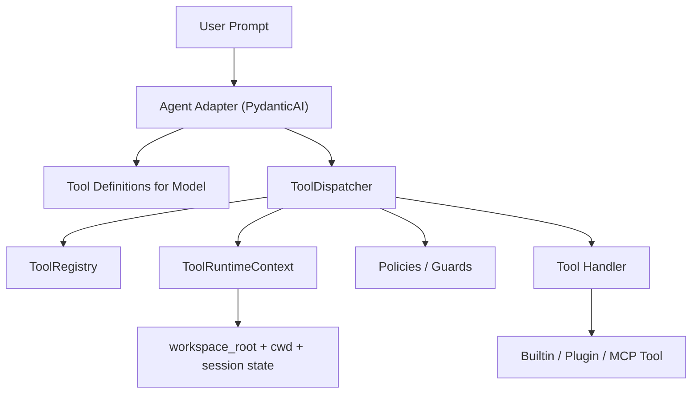

# Tool Runtime Redesign

## 背景

当前 Lumen 的工具层是围绕 `PydanticAI FunctionToolset` 组织的：

- `backend/agent/tools/toolsets/*.py` 定义 `FunctionToolset`
- `backend/agent/tools/registry.py` 负责 AST 扫描并发现这些 toolset
- `backend/agent/tools/base.py` 的 `Tool.__call__()` 充当统一执行入口
- 具体工具在各自模块内自行处理路径、安全、错误文案和局部状态

这套实现能工作，但它把几个本应拆开的职责混在了一起：

- 工具定义
- 工具暴露给模型的方式
- 工具执行与调度
- 会话级状态
- 文件系统工作区绑定
- 循环调用控制

结果是：一旦进入文件读写、路径解析、重复探索、权限控制这类复杂场景，系统很难稳定扩展，只能不断在局部补规则。

## 当前问题

### 1. `FunctionToolset` 被当成了工具系统底座

当前的注册中心本质上不是 `Tool Registry`，而是 `FunctionToolset discoverer`。

这意味着：

- 工具系统的真实主语不是“工具定义”，而是“某个 PydanticAI 包装对象”
- 如果未来更换 Agent 框架，工具层几乎不能复用
- `toolset` 配置、工具选择、运行时调度被强绑定在 PydanticAI 语义上

### 2. 缺少显式的运行时上下文绑定

以文件工具为例，当前路径解析主要依赖 `backend/agent/tools/file_security.py`：

- 优先 `AGENT_WORKSPACE_DIR`
- 再看 config
- 最后 fallback 到 `Path.home()`

这会导致一个根本问题：

用户说的相对路径，语义上往往是“相对当前项目根目录”，但系统却可能在“用户 HOME 目录”里解析。

这就是文件工具循环探索、`file_list('.')` 不对、然后去 `~ / Desktop / 其他目录` 乱找的根因。

### 3. 没有真正的中央调度层

虽然 `Tool.__call__()` 提供了统一入口，但它仍然是“每个工具实例被包装调用”的模式，不是“中央 dispatcher 按工具名调度”。

缺失中央调度层会直接影响：

- 无法统一做循环调用检测
- 无法统一做 per-session / per-tool 状态管理
- 无法自然支持字符串工具名和配置化 toolset
- 无法方便接入插件工具、MCP 工具、外部工具

### 4. 文件工具同时承担过多职责

当前 `backend/agent/tools/toolsets/file_toolset.py` 同时承担：

- 工具暴露
- 业务逻辑
- 路径策略
- 错误提示
- 局部循环缓解

这会让文件工具变成“异常复杂的特殊模块”，而不是“统一工具运行时上的一个普通 builtin tool”。

### 5. 循环控制分散且被动

当前系统更多依赖：

- 工具错误提示文案
- `usage_limits`
- 模型自己读懂提示后停止

这不是稳健的运行时控制。

一个稳定的工具系统应该能在调度层明确表达：

- 这是同一个工具的重复调用
- 这是同一路径的重复失败
- 这是相同搜索的连续执行
- 这是工作区边界之外的非法访问

## 设计目标

本次重构目标不是“修好文件工具”，而是建立一套可以长期扩展的工具运行时底座。

目标如下：

1. 工具层独立于 PydanticAI 存在
2. 工具统一以字符串 ID 注册和调度
3. 运行时上下文显式包含 `workspace_root` 和 `cwd`
4. `toolset` 变成纯配置层，而不是运行时基础设施
5. 循环检测、预算、审计、权限、trace 进入 dispatcher
6. builtin / plugin / MCP 工具走同一套注册与执行语义
7. PydanticAI 仅作为“把工具暴露给模型”的适配层

## 目标架构



核心思想：

- Agent 不直接拥有工具运行时
- Agent 只持有“可供模型看到的工具定义”
- 真正执行工具的是 `ToolDispatcher`
- 所有 handler 都拿到同一种 `ToolRuntimeContext`

## 核心模块设计

### 1. `ToolDefinition`

用途：描述一个工具是什么，不负责执行调度策略。

建议字段：

- `name: str`
- `description: str`
- `input_schema: dict`
- `category: str`
- `read_only: bool`
- `requires_approval: bool`
- `tags: set[str]`
- `handler: Callable`

说明：

- `ToolDefinition` 是注册表里的标准单元
- 不依赖 `FunctionToolset`
- 可以被不同 Agent 框架适配成不同形式

### 2. `ToolRuntimeContext`

这是重构中最关键的对象。

建议字段：

- `session_id`
- `conversation_id`
- `user_id`
- `workspace_root`
- `cwd`
- `db`
- `tool_state`
- `usage_budget`
- `trace_sink`
- `request_metadata`

其中：

- `workspace_root` 是安全边界
- `cwd` 是相对路径基准
- `tool_state` 是运行时会话状态

原则：

- 任何路径型工具都必须从这里拿运行时根目录
- 不允许工具自行 fallback 到 `HOME`

### 3. `ToolRegistry`

职责：

- 注册工具定义
- 查询工具定义
- 管理工具名与 toolset 的关系
- 解析 toolset includes
- 支持 builtin / plugin / MCP 统一注入

建议替代当前 `backend/agent/tools/registry.py` 的 AST 扫描式职责。

新的 registry 应以“工具定义”为中心，而不是以 `FunctionToolset` 为中心。

### 4. `ToolDispatcher`

这是新的架构中心。

统一执行链建议如下：

1. 查找 `ToolDefinition`
2. 参数 schema 校验
3. 工具可见性与权限检查
4. 路径归一化与 workspace 边界校验
5. 循环检测 / 重复调用保护
6. 执行 handler
7. 标准化结果
8. 记录 trace / metrics / audit log

dispatcher 负责“如何执行工具”，handler 只负责“业务逻辑本身”。

### 5. `Tool Policies`

建议独立成策略层，不散落在具体工具里。

至少包括：

- `PathPolicy`
- `ApprovalPolicy`
- `LoopGuardPolicy`
- `BudgetPolicy`
- `ResultPolicy`

#### `PathPolicy`

职责：

- 解析相对路径
- 校验路径是否落在 `workspace_root` 内
- 区分 `cwd` 和 `workspace_root`
- 阻止越界与敏感路径访问

规则建议：

- 相对路径永远相对 `ctx.cwd`
- 解析后必须在 `ctx.workspace_root` 内
- 若 `workspace_root` 缺失，直接报配置错误
- 不允许默认退回 `HOME`

#### `LoopGuardPolicy`

职责：

- 检测连续相同的 `read/search/list` 调用
- 检测相同参数的连续失败
- 在非读工具调用后重置连续计数

这部分应借鉴 Hermes 的思路，但实现应建立在 Lumen 自己的 dispatcher + session state 上。

### 6. `ToolsetResolver`

`toolset` 应重构为纯配置层。

建议类似：

```python
TOOLSETS = {
    "chat-core": {
        "description": "...",
        "tools": ["memory_search", "memory_save", "update_profile"],
        "includes": [],
    },
    "file": {
        "description": "...",
        "tools": ["file_read", "file_write", "file_list", "file_search"],
        "includes": [],
    },
    "default-chat": {
        "description": "...",
        "tools": [],
        "includes": ["chat-core"],
    },
}
```

原则：

- toolset 是配置，不是执行逻辑
- 支持 includes
- 支持不同平台 / session 动态收窄

### 7. `PydanticAI Adapter`

PydanticAI 适配层负责：

- 从 `ToolRegistry + ToolsetResolver` 生成 PydanticAI 可见的工具定义
- 把工具调用转发给 `ToolDispatcher`

这样以后如果切换到别的 Agent 运行时，只需重写 adapter，而不用重写工具系统。

## 文件工具的重构原则

文件工具应从“自己决定路径策略”改成“复用统一运行时上下文”。

### 当前问题

当前文件工具把这些事揉在一起：

- 相对路径解析
- workspace 根策略
- 访问控制
- 错误提示
- 工具暴露给模型

### 目标设计

文件 handler 只做：

- 读文件
- 写文件
- 列目录
- 搜索内容 / 文件

路径策略统一交给 `PathPolicy`。

### 路径语义

建议明确区分：

- `workspace_root`: 工具可访问边界
- `cwd`: 当前工作目录

例子：

- 用户输入 `backend/agent/tools/base.py`
- dispatcher 使用 `cwd` 解析
- 结果必须仍位于 `workspace_root` 内

这样用户说的“项目相对路径”才有稳定语义。

## 推荐目录结构

```text
backend/agent/tools/
├── core/
│   ├── definitions.py
│   ├── context.py
│   ├── registry.py
│   ├── dispatcher.py
│   ├── policies.py
│   └── toolsets.py
├── adapters/
│   └── pydanticai.py
├── builtin/
│   ├── files.py
│   ├── memory.py
│   ├── profile.py
│   └── chat_support.py
└── sessions/
    └── file_state.py
```

说明：

- `core/`：工具运行时内核
- `adapters/`：对接具体 Agent 框架
- `builtin/`：内建工具 handler
- `sessions/`：会话级状态与冲突检测

## 与 Hermes 的关系

Hermes 值得借鉴的不是具体代码片段，而是架构分层：

- 工具名是字符串
- 有中央 registry
- 有统一 dispatch
- `cwd` 在更上层已绑定
- 文件工具复用 terminal environment

Lumen 不必照搬 Hermes 的实现，但应该吸收这几个原则。

不建议直接复制 Hermes 的原因：

- Lumen 当前基于 PydanticAI，有自己的 Agent 生命周期
- Lumen 的依赖注入、数据库访问、trace 记录方式不同
- 当前工具已经围绕 `RunContext[LumenDeps]` 实现，迁移必须保留业务兼容性

因此，建议借鉴 Hermes 的架构方向，而不是机械复制某个 `_read_tracker` 或 `toolsets.py`。

## 迁移策略

这是一次底座升级，建议分阶段迁移。

### Phase 1: 引入新内核，不替换入口

新增：

- `ToolDefinition`
- `ToolRuntimeContext`
- `ToolRegistry`
- `ToolDispatcher`
- `ToolsetResolver`

此阶段保留原有 `FunctionToolset` 接口，先让新旧系统共存。

### Phase 2: 先迁移文件工具

优先迁移文件工具，因为它最暴露当前架构缺陷。

目标：

- 文件工具改为 registry + dispatcher 驱动
- 明确 `workspace_root` 与 `cwd`
- 移除默认 `HOME` fallback

### Phase 3: 适配 PydanticAI

增加 `PydanticAI Adapter`：

- 从新 registry 生成可见工具
- 将模型调用桥接到 dispatcher

此时 Agent 仍能工作，但底层工具系统已换成新内核。

### Phase 4: 迁移 memory / profile / 其他 builtin 工具

把当前：

- chat toolset
- memory 工具
- profile 工具

逐步迁移到 `builtin/` + `core/dispatcher.py`。

### Phase 5: 删除旧基础设施

最终移除：

- AST 扫描式 `FunctionToolset` 发现逻辑
- 旧 `Tool` 抽象类作为架构中心的角色
- 各 toolset 文件中的业务逻辑

保留部分兼容包装仅作为 adapter 层实现。

## 第一阶段的明确产出

如果按本设计推进，第一阶段应该至少做到：

1. `LumenDeps` 或新上下文对象中显式持有 `workspace_root` 和 `cwd`
2. 文件工具统一改走 dispatcher
3. `stream_chat()` 构造 run 级上下文时绑定当前项目工作区
4. 单独捕获 `UsageLimitExceeded`，避免把运行时问题伪装成普通“生成失败”

## 非目标

本次重构不包含：

- UI 侧工具 trace 展示重构
- 新增更复杂的用户意图识别模块
- 一次性替换所有工具实现
- 在第一阶段就引入完整插件市场或 MCP 动态刷新

这些可以建立在新工具内核稳定之后再做。

## 结论

Lumen 当前工具层的核心问题，不是某个文件工具逻辑不够细，而是：

- 工具系统以 `FunctionToolset` 为中心，而不是以 registry + dispatcher 为中心
- 运行时缺少显式的 workspace 绑定
- 会话状态与循环控制没有统一承载层

因此，正确方向不是继续对 `file_toolset.py` 局部修补，而是把工具层升级为：

- `Registry`
- `Dispatcher`
- `Runtime Context`
- `Policy Layer`
- `Adapter Layer`

PydanticAI 应保留，但应退居为适配层，而不是工具系统底座。

